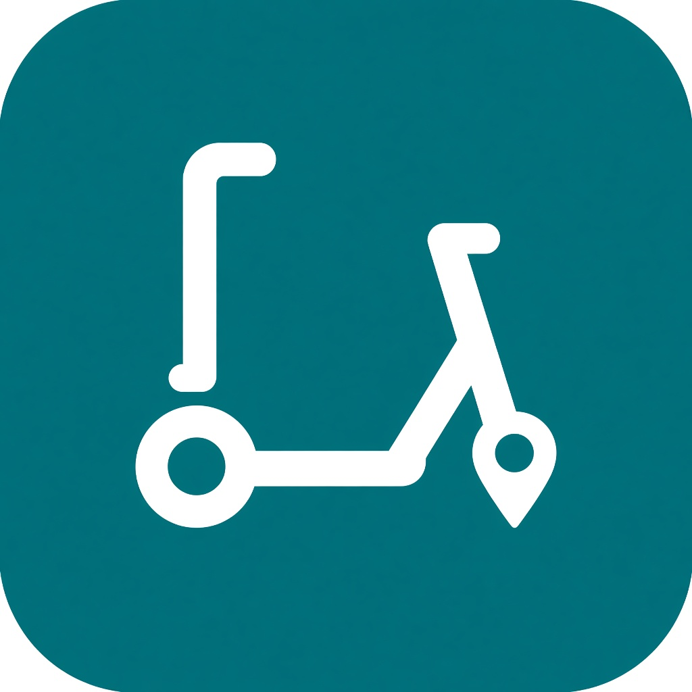

# GBFS for Home Assistant

Track shared bikes, e-bikes, and scooters from any [GBFS](https://gbfs.org) v2 or v3 feed. One config entry is one system. It polls on the feed's TTL, never faster than every 60 seconds and every 120 seconds when the feed omits a TTL, and creates sensors plus map markers for the closest available vehicles.

## Install

### HACS

1. In HACS, open the three-dot menu and choose **Custom repositories**.
2. Add `https://github.com/noambergauz/gbfs` as an **Integration**.
3. Search for **GBFS** and download it.
4. Restart Home Assistant.

### Manual

Copy `custom_components/gbfs` into `<config>/custom_components/gbfs`, then restart Home Assistant.

## Configure

Add the integration from **Settings → Devices & services → Add integration → GBFS**.

| Field | Meaning |
| --- | --- |
| Name | Title of this feed. Entity ids are based on it. |
| GBFS discovery URL | `https` URL of the provider's `gbfs.json`. |
| Latitude / longitude | Search center. Defaults to your Home location. |
| Search radius | Only vehicles inside this distance are counted. Default 500 m. |
| Maximum vehicles | How many closest vehicles to plot. Default 5. |
| Minimum battery | Free vehicles below this charge are ignored. Default 0 keeps every vehicle, including those with no battery reading. |

The discovery URL is stored on the config entry. Location, radius, the vehicle cap, and the minimum battery can be changed later from **Configure**. An existing entry keeps a minimum battery of 0 until you set one.

Coverage differs by provider. Check the nearby-count sensor after setup and widen the radius if it stays at 0.

## Entities

All entities belong to one device named after the config entry.

| Entity | State |
| --- | --- |
| `binary_sensor.<name>_usable_nearby` | On when at least one free vehicle inside the radius passed the battery filter. |
| `sensor.<name>_available_nearby` | Free vehicles inside the radius that passed the battery filter. |
| `sensor.<name>_docked_nearby` | Bikes available at stations inside the radius. |
| `sensor.<name>_nearest_distance` | Meters to the closest free vehicle. Unavailable when none qualify. |
| `sensor.<name>_nearest_battery` | Battery of that vehicle. Unavailable when it has no battery reading. |
| `sensor.<name>_nearest_station` | Meters to the closest renting station. Attributes include the station name, available vehicles, and empty docks. |
| `device_tracker.<name>_nearest_<n>` | The vehicle that is currently the n-th closest after the battery filter. |

The free-vehicle count includes `closest_vehicle_distance_m`, `search_radius_m`, `operator_name`, `last_updated`, `android_store_uri`, and `ios_store_uri`. The device page links to the Android store when that URL is present, otherwise the iOS store.

Each tracker includes `vehicle_id`, `distance_m`, `battery_level`, `current_range_meters`, and `rental_uri` when the feed publishes an http or https rental link. Put `device_tracker.<name>_nearest_*` on a Map card.

Trackers are ranked slots, not one entity per scooter. **Nearest 1** is always the closest vehicle in the latest poll. The same physical vehicle can move to another slot when the order changes. GBFS vehicle ids are not stable: the specification rotates them so a trip cannot be reconstructed, and some providers rotate them on every response.

A slot with no vehicle in range is unavailable and is hidden from the map.

## Requirements

- Home Assistant 2025.1.0 or newer
- A public GBFS v2 or v3 discovery URL

The feed must publish `free_bike_status` or `vehicle_status`, or both `station_information` and `station_status`.

## License

[MIT](LICENSE)
